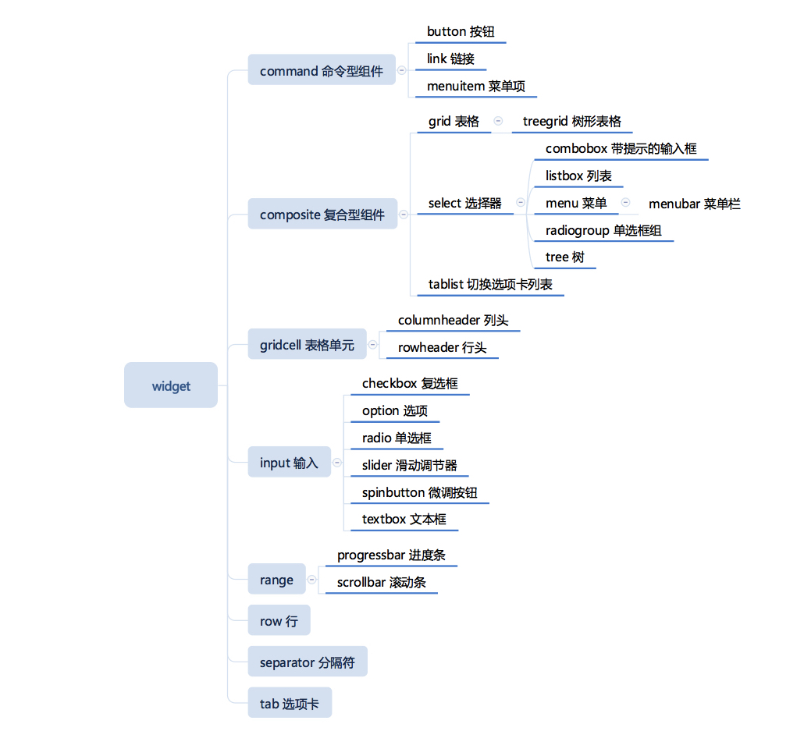

# ARIA

ARIA 是 HTML 可访问性的一份标准，表现为一组属性。这些属性不会改变 HTML 元素的行为。

## role 属性

role 属性是 ARIA 的一个核心属性。

```html
<span
  role="checkbox"
  aria-checked="false"
  tabindex="0"
  aria-labelledby="chk1-label"
>
</span>
<label id="chk1-label">Remember my preferences</label>
```

上面的代码表示给 span 一个 checkbox 的 role,同时增加了`aria-*`等属性。然后，UI 库使用 JavaScript 控制这个 span 的属性，读屏软件等通过获取这些属性理解 UI 变化。

role 主要有 3 中角色，widget/strcture/window。

### widget



### structure


### window

window 角色有三个，分别为 window/dialog/alertdialog
